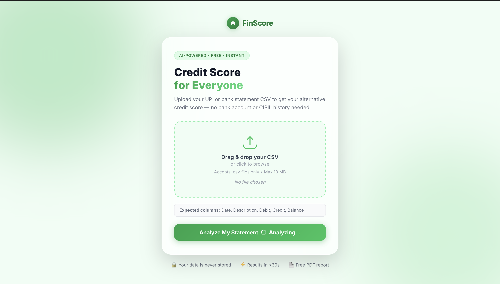
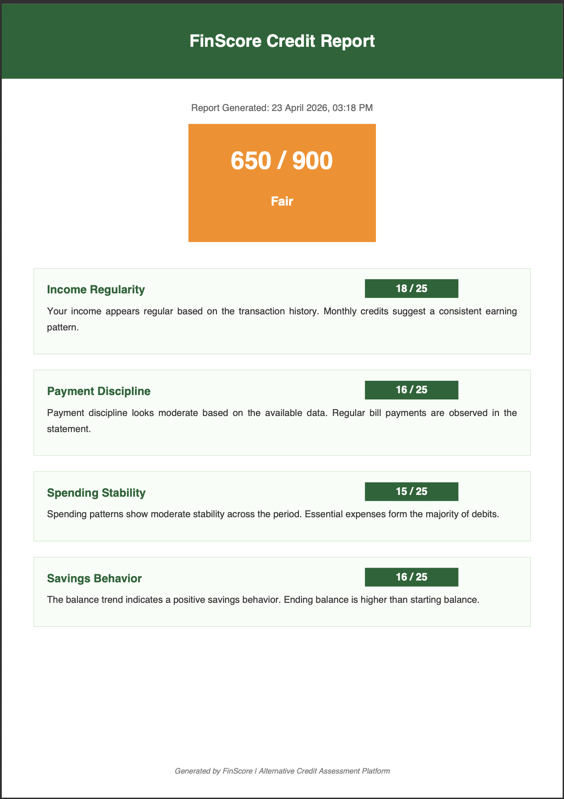

# 🏦 FinScore — 🇮🇳 Financial Inclusion via AI

> **Bridging the Credit Gap for 190M+ Unbanked Indians**  
> FinScore is an AI-driven alternative credit assessment platform that analyzes UPI / bank statement CSVs to generate a professional credit report for users without formal credit history.

---

## 🚀 The Mission
Over **190 million Indians** earn consistently through UPI but lack a formal "CIBIL Score," making them ineligible for traditional loans. **FinScore** bridges this gap by transforming transaction metadata into a high-trust alternative credit score powered by **Google Gemini 1.5 Flash**.

---

## ✨ Key Features
- 📊 **Intelligent Analysis**: Automatically parses CSV transaction logs to identify earning patterns.
- 🧠 **AI-Powered Insights**: Uses Gemini 1.5 Flash to provide human-like qualitative assessments of financial health.
- 🎨 **Dynamic Dashboard**: A premium, green-themed UI featuring animated score rings and interactive factor cards.
- 📄 **Professional PDF Export**: One-click download of a structured and readable PDF report.
- 🔒 **Privacy First**: Fully stateless design. Data is processed in real-time and never stored permanently.

---

## 🛠️ Tech Stack
| Component | Technology |
| :--- | :--- |
| **Backend** | Python 3.9+ / Flask |
| **Generative AI** | Google Gemini 1.5 Flash API |
| **Data Engine** | Pandas (Time-series & statistical analysis) |
| **Report Engine** | fpdf2 (Dynamic Layout Engine) |
| **Frontend** | HTML5, Vanilla CSS (Custom Design System) |

---

## 🧠 How It Works (The Logic)

### 1. Data Engineering (Pandas)
The engine parses the raw statement and extracts:
- **Income Regularity**: Counts months where credits exceed ₹1,000.
- **Spending Velocity**: Calculates the Debit-to-Credit ratio.
- **Financial Trend**: Compares starting vs. ending balance to determine the "Balance Trend."
- **Stability**: Measures transaction volume and monthly averages to detect anomalies.

### 2. AI Assessment (Gemini 1.5 Flash)
A transaction summary is sent to AI to generate insights, which generates:
- **Qualitative Reasoning**: Why a specific score was given.
- **Risk Assessment**: Suitability for small-ticket credit products.
- **Factor Scoring**: Breakdown of Income, Payments, Spending, and Savings (0–25 each).

---

## 📥 Getting Started

### 1. Prerequisite: Gemini API Key
Generate a free API key at [Google AI Studio](https://aistudio.google.com/).

### 2. Installation
```bash
cd finscore
python3 -m pip install -r requirements.txt
```

### 3. Run the App
```bash
python3 app.py
```
Open **[http://localhost:5050](http://localhost:5050)** in your browser.

---

## 📊 Score Bands
| Range | Band | Visual Indicator |
| :--- | :--- | :--- |
| **300–549** | Poor | 🔴 High Risk |
| **550–699** | Fair | 🟠 Moderate Risk |
| **700–799** | Good | 🟢 Healthy |
| **800–900** | Excellent | 🟢 Prime |

---

## 🤝 Team & Credit
**Developed by:** Gouseraza  
**Hackathon:** First Hackathon 2026

---

## 📸 Screenshots

### Home Page


### Result Dashboard


